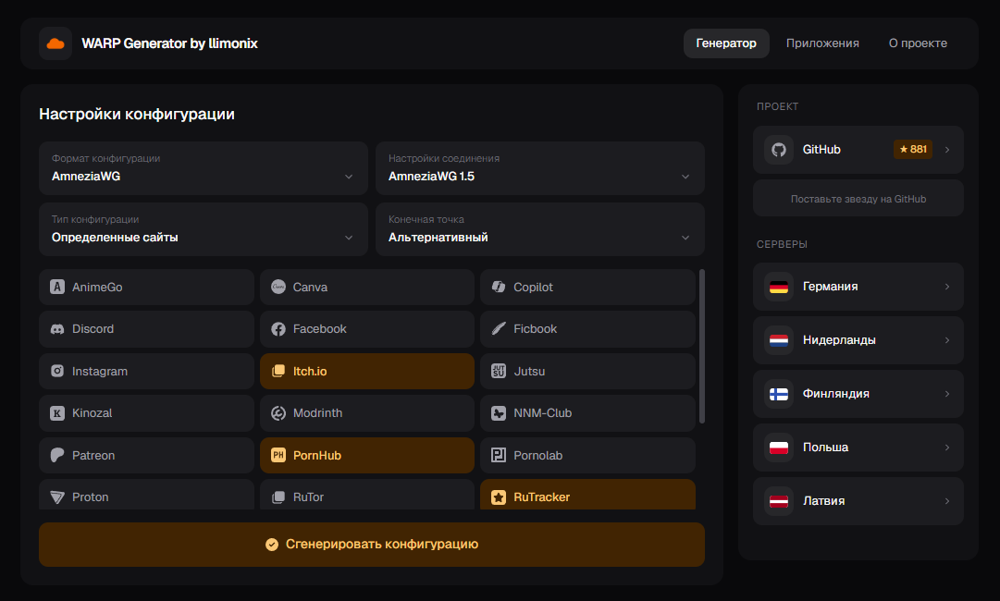

# WARP Configuration Generator

**Русский** | [English](README.md)



Открытый генератор конфигов Cloudflare WARP (WireGuard / AmneziaWG / Clash / Throne / Nekoray / Husi / Karing / WireSock).
Это **публичная** ветка — без капчи, без аналитики, без промо-блоков. Self-host friendly.

## 🚀 Быстрое развертывание

### Docker (рекомендуется)

Готовый образ публикуется в GHCR при каждом пуше в `master`:

```bash
docker run -d --name warp-generator \
  -p 3000:3000 \
  --restart unless-stopped \
  ghcr.io/nellimonix/warp-config-generator-vercel-public:latest
```

Откройте http://localhost:3000.

### Docker — сборка локально

```bash
docker build -t warp-generator-public .
docker run -d -p 3000:3000 --name warp-generator warp-generator-public
```

### docker-compose

```yaml
services:
  warp-generator:
    image: ghcr.io/nellimonix/warp-config-generator-vercel-public:latest
    container_name: warp-generator
    ports:
      - "3000:3000"
    restart: unless-stopped
```

### Vercel

[](https://vercel.com/new/clone?repository-url=https://github.com/nellimonix/warp-config-generator-vercel&repository-name=warp)
- Или через [CLI](https://vercel.com/docs/cli): `vercel deploy`
- Локально: `vercel dev`

### Netlify

[](https://app.netlify.com/start/deploy?repository=https://github.com/nellimonix/warp-config-generator-vercel&siteName=warp)
- Или через [CLI](https://docs.netlify.com/cli/get-started/): `netlify deploy`
- Локально: `netlify dev`

### Cloudflare Workers

[](https://deploy.workers.cloudflare.com/?url=https://github.com/nellimonix/warp-config-generator-vercel)
- Или через [Wrangler](https://developers.cloudflare.com/workers/wrangler/): `wrangler deploy`
- Локально: `wrangler dev`

### Cloudflare Pages

Тот же `wrangler.jsonc` подходит для Pages со static export.

```bash
CLOUDFLARE_WORKERS=1 npm run build
npx wrangler pages deploy out --project-name=warp-generator
```

Либо подключите репозиторий в Cloudflare dashboard:
- Build command: `CLOUDFLARE_WORKERS=1 npm run build`
- Output directory: `out`

## 🛠️ Локальная разработка

```bash
npm install
npm run dev          # dev-сервер на :3000
npm run build        # production-сборка
npm run start        # запуск production-сборки
npm run lint
```

## ➕ Добавить новый сервис (приветствуется PR)

Режим «выбранные сайты» позволяет роутить через WARP только определённые сервисы.
Чтобы добавить свой:

1. **Форкните** репо и создайте ветку (например `feat/service-newsite`).
2. **Создайте** `config/services/<ключ-сервиса>.json`:
   ```json
   {
     "name": "Название сервиса",
     "icon": "FaIconName",
     "iconLibrary": "fa",
     "type": "new",
     "ips": "1.2.3.0/24, 5.6.7.0/24, ..."
   }
   ```
   - `name` — видимое пользователю название.
   - `icon` — имя иконки из [react-icons](https://react-icons.github.io/react-icons/). Проверьте что такая иконка есть в выбранной библиотеке.
   - `iconLibrary` — одно из: `fa`, `fa6`, `si`, `bi`, `md`, `ri` и т.д. (соответствует sub-пакету react-icons).
   - `type` — опционально. Поставьте `"new"` чтобы показать бейдж «NEW».
   - `ips` — CIDR-диапазоны через запятую. Используйте реальный ASN/IP-lookup: Cloudflare whois, BGP.tools, либо `whois -h whois.cymru.com " -v <ip>"`.
3. **НЕ редактируйте** `worker/api-handler.js` и `functions/api/generate.js`. GitHub Action (`build-ip-ranges`) автоматически перегенерирует блок `IP_RANGES` в обоих файлах после мерджа в `master` и засинхронизирует новый сервис в ветку `production`.
4. **Откройте PR** в `master`.

### Локальная проверка ребилда

```bash
node scripts/build-ip-ranges.mjs
```

Читает `config/services/*.json` и переписывает блок `// IP_RANGES:BEGIN ... // IP_RANGES:END` в обоих файлах worker/functions. Можно запускать сколько угодно раз — идемпотентно.

## 📁 Структура проекта

```
├── app/
│   ├── layout.tsx                 Корневой layout (шрифт Geist, мета)
│   ├── page.tsx                   Серверный компонент — загрузка сервисов
│   ├── not-found.tsx              Страница 404
│   └── api/generate/route.ts      POST endpoint (генерация конфигов)
│
├── components/
│   ├── home-client.tsx            Клиентская оболочка (табы, состояние)
│   ├── layout/
│   │   ├── topbar.tsx             Логотип + навигация по табам
│   │   ├── sidebar.tsx            GitHub + список серверов (sticky)
│   │   └── footer.tsx
│   ├── generator/
│   │   ├── config-selectors.tsx   Кастомные дропдауны (формат, тип и пр.)
│   │   ├── service-picker.tsx     Сетка выбора сервисов
│   │   ├── result-panel.tsx       Блок результата (скачать / копировать / QR)
│   │   ├── formats-tab.tsx        Список поддерживаемых форматов
│   │   └── about-tab.tsx          О проекте + совместимые клиенты
│   └── icons/                     Резолвер иконок + флаги
│
├── config/
│   ├── services/                  JSON-файлы — по одному на сервис (IP-диапазоны)
│   ├── services-loader.ts         Автозагрузка всех JSON при старте
│   ├── endpoints.ts               Endpoint-ы Cloudflare WARP
│   └── formats.ts                 Определения форматов конфигов
│
├── lib/
│   ├── builders/                  По одному файлу на формат конфига
│   │   ├── wireguard.ts
│   │   ├── throne.ts
│   │   ├── clash.ts
│   │   ├── nekoray.ts
│   │   ├── husi.ts
│   │   ├── karing.ts
│   │   ├── wiresock.ts
│   │   ├── shared.ts              Профили устройств, DNS, константы
│   │   └── index.ts               Диспетчер — buildConfig(format, params)
│   ├── warp-service.ts            Оркестратор (ключи → CF → сборка → QR)
│   ├── cloudflare-client.ts       Регистрация через Cloudflare WARP API
│   ├── crypto.ts                  Генерация ключей (tweetnacl)
│   ├── qr-generator.ts            QR через внешний API + SVG-заглушка
│   └── ip-ranges.ts               Реэкспорт из services-loader
│
├── hooks/
│   ├── use-generator.ts           Клиентская логика генерации
│   └── use-mobile.ts              Хук адаптивности
│
├── scripts/
│   └── build-ip-ranges.mjs        Регенерация IP_RANGES в worker + functions
│
├── worker/                        Cloudflare Workers runtime
├── functions/                     Netlify Functions runtime
├── types/                         TypeScript типы
├── styles/globals.css             Дизайн-токены + тёмная тема
├── .github/workflows/             CI: Docker build, IP_RANGES rebuild
├── Dockerfile                     Standalone production-сборка (public)
├── next.config.mjs
└── package.json
```

## 🔧 Конфигурация

Публичная сборка не требует переменных окружения. Генератор работает анонимно
через публичный Cloudflare WARP API регистрации.

### Режимы сборки

`next.config.mjs` переключает `output` по переменным окружения:

| Переменная                    | Output           | Где используется         |
|-------------------------------|------------------|--------------------------|
| `DOCKER_BUILD=1`              | `standalone`     | Docker / Dokploy         |
| `CLOUDFLARE_WORKERS` / `CF_PAGES` | `export`     | CF Workers / CF Pages    |
| _нет_                         | по умолчанию     | Vercel / Netlify         |

## 🌐 Поддерживаемые платформы

| Платформа             | Поддержка | Заметки                                  |
|-----------------------|-----------|------------------------------------------|
| Docker (self-host)    | ✅ Полная | Standalone-сервер Next.js                |
| Vercel                | ✅ Полная | Default runtime                          |
| Netlify               | ✅ Полная | Edge functions                           |
| Cloudflare Workers    | ✅ Полная | Static export + worker                   |
| Cloudflare Pages      | ✅ Полная | Static export                            |

## 📄 Лицензия

MIT License — см. [LICENCE](LICENCE)

## 🤝 Вклад в развитие

1. Форкните репозиторий
2. Создайте ветку для новой функции
3. Внесите изменения
4. Создайте Pull Request

## 🔗 Зеркала / Альтернативные ссылки

- Telegram Bot: [t.me/warp_generator_bot](https://t.me/warp_generator_bot)
- Основной сайт: [warp3.llimonix.pw](https://warp3.llimonix.pw)  
- Vercel Mirror: [warply2.vercel.app](https://warply2.vercel.app)
- Netlify Mirror: [getwarp2.netlify.app](https://getwarp2.netlify.app)
- Cloudflare Mirror: [warp.llimonix.workers.dev](https://warp.llimonix.workers.dev)
- Telegram канал: [ллимоникс </>](https://t.me/+PWiSh2qvtmphMjcy)
